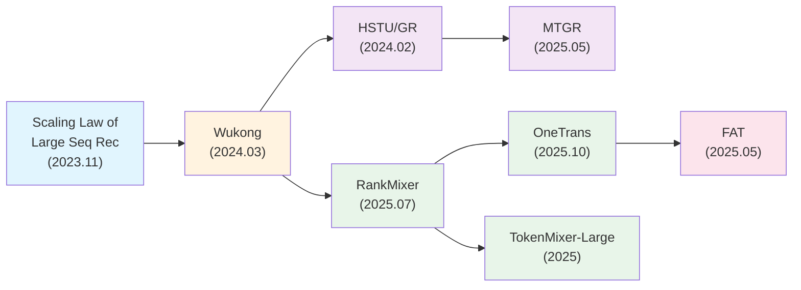

## 概述

搜推精排模型的 Scaling Up 历程，本质上是回答一个问题：**推荐系统能否像 LLM 一样，通过持续增加模型参数和计算量来获得可预测的性能提升？** 从 2023 年的学术探索到 2025 年的工业落地，这一方向经历了"验证可行性→找到正确架构→解决工程瓶颈→统一建模范式"四个阶段。核心论文按时间线排列为：[[Scaling_Law_of_Large_Sequential_Recommendation_Models|Scaling Law of Large Seq Rec]]（2023，学术验证）→ [[Wukong_Towards_a_Scaling_Law_for_Large_Scale_Recommendation|Wukong]]（2024，工业级架构）→ [[HSTU_Actions_Speak_Louder_than_Words|HSTU]]（2024，生成式范式）→ [[MTGR_Multi_Task_Generative_Recommender|MTGR]]（2025，混合式落地）→ [[RankMixer_Scaling_Up_Ranking_Models_in_Industrial_Recommenders|RankMixer]]（2025，硬件感知）→ [[OneTrans_Unified_Feature_Interaction_and_Sequence_Modeling|OneTrans]]（2025，统一架构）→ [[FAT_From_Scaling_to_Structured_Expressivity|FAT]]（2025，理论 Scaling Law）→ [[TokenMixer_Large_Scaling_Up_Large_Ranking_Models_in_Industrial_Recommenders|TokenMixer-Large]]（2025，15B 极限规模）。

> [!tip] 与主脉络的关系
> 本文是 [[搜推精排模型发展脉络]] 第六、七阶段的深度展开，聚焦 Scaling Up 这一条技术主线。第九章还整理了美团内部在 Mixer 路线（MTmixAtt → MTLightAttention）和生成式路线（MTGR → 双流 MTGR → MTFM）上的落地实践。

---

## 一、为什么推荐系统需要 Scaling Up？

推荐系统的精排模型长期停留在"百万参数"量级——DIN/DIEN 的核心模块通常只有几百万参数，即使是 DCN-V2 这样的工业基线也很少超过千万。与此形成鲜明对比的是，NLP 领域在 2020 年就已经进入了百亿参数时代（GPT-3），CV 领域的 ViT 系列也迅速扩展到数十亿参数。

推荐模型"做不大"的原因有三个层面。首先是**数据特殊性**：推荐输入是高度异构的结构化特征（稀疏 ID、数值统计量、交叉特征），不像 NLP 的同质 token 序列那样天然适合 Transformer 处理。其次是**工程约束**：在线推荐服务对延迟极为敏感（通常 < 15ms），QPS 高达数万到数十万，这意味着模型不能简单地堆参数。最后是**架构瓶颈**：传统 DLRM 的计算量集中在 Embedding 查找（稀疏扩展）而非 Dense 计算，简单增加 Embedding 表大小的收益迅速递减。

2023-2025 年间的一系列工作，正是围绕破解上述三个瓶颈而展开的。

---

## 二、核心论文时间线与演进脉络

按核心贡献可以将这些工作分为四条路线：

| 路线 | 核心问题 | 代表论文 |
|------|----------|----------|
| 学术验证 | Scaling Law 在推荐中是否成立？ | Scaling Law of Large Seq Rec |
| Dense Scaling 架构 | 如何设计能持续 Scale 的特征交叉网络？ | Wukong, FAT |
| 生成式范式 | 能否用统一序列模型替代异构 DLRM？ | HSTU, MTGR |
| 硬件感知 Scaling | 如何在延迟不变的前提下把模型做大？ | RankMixer, OneTrans, TokenMixer-Large |

---

## 三、逐篇论文核心解读

### 3.1 Scaling Law of Large Sequential Recommendation Models（2023）

> **机构**：人大 + 腾讯微信 + UCSD | **发表**：RecSys 2024

**核心思路**：首次系统验证纯 ID-based 序列推荐模型的 Scaling Law。采用与 SASRec 相同的 Decoder-only Transformer 架构，通过 Layer-wise Adaptive Dropout 和 Switching Optimizer 两项训练策略，将模型从 98.3K 参数成功扩展到 0.8B 参数。

**关键发现**：

- 推荐模型的测试损失 $L$ 与模型参数量 $N$ 满足幂律关系 $L(N) = \alpha_N \cdot N^{-\beta_N} + L_\infty$，其中 $\alpha_N = 0.121$，$\beta_N = 0.399$
- 与 NLP 的 $\beta_N \approx 0.076$（Chinchilla）相比，推荐模型参数扩展的收益斜率更陡，意味着推荐领域"做大模型"的边际收益可能更高
- 大模型在冷启动、长尾推荐、序列顺序理解、鲁棒性和快速适应五个挑战性任务上展现出质变式的涌现能力

**创新点**：

- **Layer-wise Adaptive Dropout**：不同层使用不同的 dropout 率（浅层高、深层低），避免大模型的过拟合
- **Switching Optimizer**：训练初期用 Adagrad（稳定），后期切换为 Adam（更好的收敛），解决大模型训练不稳定问题
- **Predictable Scaling**：可以用小模型的 Scaling 曲线外推预测大模型的性能

**可借鉴的点**：(1) 证明了即使在数据极度稀疏的推荐场景（MovieLens-20M 仅 18.5M 交互），Scaling Law 依然成立；(2) Layer-wise Adaptive Dropout 是一种通用的大模型训练稳定化技术；(3) 涌现能力的发现为推荐系统"做大模型"提供了超越 AUC 数字的价值论证。

---

### 3.2 Wukong: Towards a Scaling Law for Large-Scale Recommendation（2024）

> **机构**：Meta AI | **发表**：ICML 2024

**核心思路**：设计了一种专为推荐系统打造的、能展现 Scaling Law 的 Dense 网络架构。核心创新是 Interaction Stack——通过堆叠 Factorization Machine Block（FMB）和 Linear Compression Block（LCB），以二进制指数方式捕获高阶特征交互（$l$ 层捕获 1 到 $2^l$ 阶交互），同时通过金字塔压缩结构控制计算复杂度。

**关键发现**：

- 在 Meta 内部 1460 亿条、720 个特征的工业数据集上，Dense 层参数从 0.74B 扩展到 17B，性能展现出持续的幂律提升
- 与 DCNv2、AutoInt+、MaskNet 等基线对比，Wukong 是唯一在 >100 GFLOP 范围内仍保持稳定 Scaling 的架构
- 训练计算量翻两番，性能约提升 0.1%（NE 指标），这一规律跨 2 个数量级保持稳定

**创新点**：

- **二进制指数交互**：堆叠 FM + 残差连接使交互阶数呈 $2^l$ 增长，比 Transformer（每层 +2 阶）和 DCN（每层 +1 阶）更高效
- **金字塔压缩**：每层 LCB 将 token 数量减半（$n_i \to n_i/2$），使深层只保留最重要的特征组合，计算量受控
- **Dense Scaling vs Sparse Scaling 的区分**：明确提出推荐系统的 Scaling 应聚焦 Dense 部分（计算密集型），而非 Embedding 表（访存密集型）

**可借鉴的点**：(1) FM-based 堆叠 + 残差的设计思路简洁有效，适合工业部署；(2) 金字塔压缩是一种通用的深度网络效率优化策略；(3) 论文中"Dense Scaling vs Sparse Scaling"的分析框架可以指导工业界做模型规模化决策。

---

### 3.3 HSTU / Generative Recommenders（2024）

> **机构**：Meta | **发表**：ICML 2024

**核心思路**：提出全新的推荐范式——将推荐问题重新定义为序列转导任务，用统一的 HSTU（Hierarchical Sequential Transduction Unit）架构替代传统的 Embedding+MLP 范式。核心洞察是 **"Actions Speak Louder than Words"**：用户行为本身就是最有价值的特征，一个足够强大的序列模型可以从原始行为序列中隐式捕获所有传统统计特征的信息。

**关键发现**：

- GR 模型仅使用原始交互特征就超越了使用数千个人工特征的 DLRM，在 Meta 在线实验中排序任务 **+12.4%** 主要参与指标
- 模型质量随训练计算量呈幂律增长，跨越三个数量级验证了推荐系统的 Scaling Law
- HSTU 比 FlashAttention2-based Transformer 快 5.3x-15.2x
- M-FALCON 推理算法使 GR 模型比 DLRM 复杂 285x，但推理吞吐量反而提升 1.5x-3x

**创新点**：

- **统一特征空间**：将数千个异构特征压缩为单一时间序列表示，消除了特征工程
- **Pointwise Attention**（SiLU 替代 Softmax）：保留了用户兴趣的绝对强度信息，适应非平稳的推荐数据
- **Stochastic Length**：利用用户行为的时间重复性进行随机稀疏化，将 attention 复杂度从 $O(N^2d)$ 降至 $O(N^\alpha d)$（$\alpha \approx 1.6$）
- **M-FALCON 推理**：通过微批次化 + KV 缓存，实现了万亿参数级模型的工业部署

**可借鉴的点**：(1) 生成式训练将编码器成本分摊到多个 target 上，训练效率提升 $O(N)$ 倍；(2) Pointwise Attention 在非平稳数据上优于 Softmax Attention，值得在推荐/广告场景尝试；(3) HSTU 的无 FFN 设计（通过门控替代）将每层激活内存从 $33d$ 降至 $14d$，可以构建 2x 更深的网络。

---

### 3.4 MTGR: Multi-Task Generative Recommender（2025）

> **机构**：美团 | **发表**：CIKM 2025

**核心思路**：在 HSTU 架构的基础上解决一个关键矛盾——HSTU/GR 要求放弃传统 DLRM 精心构建的交叉特征，但在美团外卖这样的交易场景中，交叉特征（如用户对候选商家的历史 CTR、曝光次数等）包含不可替代的信息。MTGR 采用混合式架构：HSTU 的序列编码能力 + DLRM 的完整特征体系，实现"两全其美"。

**关键发现**：

- 即使最小的 MTGR-small（5.47 GFLOPs）也超越了最强 DLRM 基线 UserTower-SIM（0.86 GFLOPs）
- 三种尺寸（small/medium/large）展现出平滑的 Scaling 趋势
- 去除交叉特征后性能严重下降，且 Scaling 无法弥补这一损失——这是对 HSTU "不需要交叉特征"论点的重要补充
- 线上部署：FLOPs 提升 65 倍，训练成本与 DLRM 持平，推理成本反而降低 12%，外卖首页 CTR +1.31%，订单量 +1.22%

**创新点**：

- **Group Layer Normalization**：对不同类型的 Token（用户画像/行为序列/候选）使用不同的 LayerNorm 参数，解决异构 Token 的语义对齐问题
- **动态混合掩码**：三条规则（静态全可见 + 动态因果 + 候选对角）严格保证因果性，同时最大化 Encoder 的学习能力
- **用户粒度聚合**：训练样本从"所有候选数"压缩到"所有用户数"，配合 TorchRec 优化实现 65x FLOPs 提升下训练成本持平

**可借鉴的点**：(1) Group LayerNorm 是处理推荐系统异构输入的通用方案；(2) "保留交叉特征 + 生成式架构"的混合思路适合特征工程积累深厚的业务场景；(3) 动态掩码的设计思路（按特征类型定义因果性规则）可推广到其他多源异构输入场景。

---

### 3.5 RankMixer: Scaling Up Ranking Models（2025）

> **机构**：字节跳动 | **发表**：arXiv 2025

**核心思路**：解决精排模型 Scaling 的关键工程矛盾——**模型参数扩大 100 倍但不增加推理延迟**。核心设计哲学是"让模型设计与硬件特性对齐"：用无参数的 Multi-head Token Mixing 替代计算密集的 Self-Attention，用独立参数的 Per-token FFN 替代共享参数的 FFN，使参数增长不再绑定计算增长。

**关键发现**：

- MFU（Model FLOPs Utilization）从传统 DLRM 的 4.5% 提升到 45%，意味着同样的 GPU 资源可以支撑 10x 更大的模型
- 1B Dense 参数模型在抖音推荐和广告两大场景全量上线，用户活跃天数 +0.3%，应用内使用时长 +1.08%
- AUC vs 参数量呈现清晰的幂律关系，在 [14M, 1B] 参数范围内斜率稳定

**创新点**：

- **Zero-Param Token Mixing**：通过 multi-head split → cross-token reassemble → concat 实现特征交叉，无需学习任何权重，计算量为零
- **Per-token FFN**：每个 token 拥有独立的 FFN 参数（而非 Transformer 中共享的 FFN），捕获不同特征子空间的异质性
- **DTSI（Dense-Training Sparse-Inference）+ ReLU Routing**：训练时所有 expert 参与前向/反向，推理时只激活 Top-K expert，解决 MoE 中专家训练不充分和负载不均衡的问题
- **硬件感知设计**：所有计算都是大型矩阵乘法，天然适合 GPU Tensor Core

**可借鉴的点**：(1) "MFU 优先"的设计理念——不是先设计算法再适配硬件，而是从硬件特性出发反向设计算法；(2) Token Mixing 证明了特征交叉不一定需要学习的权重矩阵，结构性的信息重组就能实现有效交叉；(3) DTSI 策略是 MoE 在推荐场景落地的实用方案。

---

### 3.6 OneTrans: Unified Feature Interaction and Sequence Modeling（2025）

> **机构**：字节跳动 / NTU | **发表**：WWW 2026

**核心思路**：回答一个架构层面的根本问题——**特征交叉和序列建模能否用同一个 Transformer 统一处理？** OneTrans 通过 Unified Tokenizer 将序列特征和非序列特征转换到同一 token 空间，用 Mixed Parameterization Transformer 联合建模，实现了四类交互（序列内、跨序列、特征间、序列-特征间）的统一处理。

**关键发现**：

- 在工业规模数据集上观察到接近对数线性的性能增益（参数翻倍 → AUC 提升约 0.001）
- 线上 A/B 测试 GMV 提升 5.68%（极其显著的业务收益）
- 消融实验表明 Auto-Split Tokenizer 优于人工分组（Group-wise），说明让模型自动学习如何划分 token 更优

**创新点**：

- **Mixed Parameterization**：同质的序列 token 共享一组参数，异质的非序列 token 各自拥有独立参数——在参数效率和表达能力之间取得平衡
- **Pyramid Stacking**：每隔几层合并部分 token，逐层减少序列长度，保证深层计算效率
- **KV Cache for Ranking**：借鉴 LLM 推理优化，在精排场景实现 KV Cache 复用，用户表征只计算一次
- **Unified Tokenizer**：Auto-Split 方案将所有特征拼接后自动切分为 token，免去人工分组

**可借鉴的点**：(1) "统一 token 化 + 单一 Transformer"的范式简化了工程实现，可以直接复用 LLM 生态的优化工具（FlashAttention, KV Cache）；(2) Mixed Parameterization 是处理异构输入的优雅方案；(3) Pyramid Stacking 是一种适用于长序列推荐场景的通用效率优化。

---

### 3.7 FAT: Field-Aware Transformer（2025）

> **机构**：阿里妈妈 | **发表**：arXiv 2025

**核心思路**：从理论层面回答"为什么标准 Transformer 在 CTR 预测中无法有效 Scale"这一根本性问题。核心洞察是：CTR 输入的结构化 field-value 对具有天然的异质性，标准 attention 的共享 QK 矩阵无法区分不同 field 对的交互模式。FAT 将 attention score 解耦为 Field-Aware Content Alignment 和 Field-Pair Modulation 两个独立组件。

**关键发现**：

- 首次基于 Rademacher 复杂度建立了 CTR 模型的理论 Scaling Law：$\Delta AUC \propto N_{params}^{0.433}$
- 在淘宝搜索广告 14B 曝光数据上，从 52M 到 1.5B 参数持续性能提升
- 线上部署 RPM 提升 1.8%

**创新点**：

- **Field-Decomposed Attention**：$\alpha_{ij} = (e_i W_Q^{(f_i)})(e_j W_K^{(f_j)})^T \cdot w_{f_i, f_j}$，将参数复杂度从 $O(F^2 d^2)$ 降至 $O(Fd^2 + F^2)$
- **Basis-Composed Hypernetwork**：$M$ 个共享 basis 矩阵 + Top-K 稀疏选择动态生成 field-specific 参数，推理时无额外开销
- **理论 Scaling Law**：基于 Rademacher 复杂度推导，给出了 AUC 随参数量增长的理论上界，为实验观察提供了数学解释

**可借鉴的点**：(1) Field-Decomposed Attention 的解耦思路可推广到任何结构化输入的 attention 机制设计；(2) 理论 Scaling Law 为工业界的模型扩展投入提供了量化预期；(3) Hypernetwork + Top-K 稀疏选择是一种"训练时丰富、推理时零开销"的实用策略。

---

### 3.8 TokenMixer-Large（2025）

> **机构**：字节跳动 | **发表**：arXiv 2025

**核心思路**：RankMixer/TokenMixer 的升级版本，将推荐精排模型推向 **15B 参数**的极限规模。解决了 RankMixer 在进一步 Scale 时遇到的三个核心问题：残差路径语义不对齐、原始 token 信息丢失、训练效率瓶颈。

**关键发现**：

- 15B 参数模型在抖音电商、广告、直播三大场景取得显著线上收益
- Mixing & Reverting 操作比原始 RankMixer 的 mixing-only 方案在 Scaling 曲线上有明显优势
- Token Parallel 策略使 15B 模型可以在数百 GPU 上高效训练

**创新点**：

- **Mixing & Reverting**：mixing 后通过 reverting 操作将信息投射回原始 token 空间，修复残差路径的语义对齐问题（保证 Original Token Residual + Token Semantic Alignment）
- **Sparse-Pertoken MoE**：每个 token 拥有独立的 expert 集合，实现"稀疏训练 + 稀疏推理"，比 RankMixer 的 DTSI（Dense Train Sparse Infer）更适合超大规模
- **Token Parallel**：将不同 token 的 Pertoken 参数分布到不同 GPU 上，类似 LLM 中的 Tensor Parallel 但针对 Pertoken 架构定制
- **Inter-layer Residual + Auxiliary Loss**：跨层残差连接和辅助损失函数保障 15B 深层模型的训练稳定性

**可借鉴的点**：(1) Mixing & Reverting 是对 Token Mixing 范式的重要修正，解决了残差连接在 token 数量变化时的语义对齐问题；(2) Sparse-Pertoken MoE 的设计思路——"每个特征子空间有自己的专家"——符合推荐系统特征异构的本质；(3) Token Parallel 是推荐模型走向极大规模时的必要分布式策略。

---

## 四、横向对比与核心维度分析

### 4.1 架构设计对比

| 论文 | 特征交叉机制 | 序列建模 | 参数规模 | MFU | 推理策略 |
|------|------------|---------|---------|-----|---------|
| [[Scaling_Law_of_Large_Sequential_Recommendation_Models\|Scaling Law Seq Rec]] | 无（纯序列） | Decoder-only Transformer | 0.8B | - | - |
| [[Wukong_Towards_a_Scaling_Law_for_Large_Scale_Recommendation\|Wukong]] | 堆叠 FM（二进制指数） | 无 | 17B (Dense) | 低 | 直接推理 |
| [[HSTU_Actions_Speak_Louder_than_Words\|HSTU]] | 门控隐式交叉 | Pointwise Attention | 1.5T | - | M-FALCON |
| [[MTGR_Multi_Task_Generative_Recommender\|MTGR]] | DLRM 交叉特征 + HSTU | HSTU Self-Attention | ~55 GFLOPs | - | 用户粒度聚合 |
| [[RankMixer_Scaling_Up_Ranking_Models_in_Industrial_Recommenders\|RankMixer]] | Zero-param Token Mixing | Per-token FFN | 1B (Dense) | 45% | DTSI |
| [[OneTrans_Unified_Feature_Interaction_and_Sequence_Modeling\|OneTrans]] | Mixed Causal Attention | 同一 Transformer | ~数十亿 | - | KV Cache |
| [[FAT_From_Scaling_to_Structured_Expressivity\|FAT]] | Field-Decomposed Attention | 无 | 1.5B | - | Hypernetwork |
| [[TokenMixer_Large_Scaling_Up_Large_Ranking_Models_in_Industrial_Recommenders\|TokenMixer-Large]] | Mixing & Reverting | Sparse-Pertoken MoE | 15B | - | Token Parallel |

### 4.2 三大技术路线的分化与融合

**路线一：Dense Scaling（Wukong → FAT）**——聚焦特征交叉模块的规模化。Wukong 用堆叠 FM 实现了 Dense 层的 Scaling Law，FAT 从理论层面解释了"为什么需要 field-aware 的 attention"并给出了理论 Scaling Law。这条路线的优势是架构简洁、与现有 DLRM 兼容性好，劣势是缺乏序列建模能力。

**路线二：生成式范式（HSTU → MTGR）**——用统一的序列模型替代异构 DLRM。HSTU 证明了"Actions Speak Louder than Words"，MTGR 在此基础上补回了交叉特征的信息增益。这条路线的优势是天然具备 Scaling Law（序列模型已在 LLM 中充分验证），劣势是工程改造成本高。

**路线三：硬件感知 Scaling（RankMixer → OneTrans → TokenMixer-Large）**——从硬件特性出发反向设计模型。RankMixer 将 MFU 从 4.5% 提升到 45%，OneTrans 统一了特征交叉和序列建模，TokenMixer-Large 推向 15B 极限。这条路线的优势是兼顾了效果和工程可行性，是目前工业界最主流的方向。

三条路线正在走向融合。OneTrans 已经将路线一（特征交叉）和路线二（序列建模）统一到同一个 Transformer 中，MTGR 将路线二的生成式架构与传统 DLRM 的特征体系结合，TokenMixer-Large 在路线三的基础上不断逼近路线二的参数规模。

---

## 五、关键 Scaling 规律汇总

| 论文 | Scaling 公式 / 规律 | 数据来源 | 参数范围 |
|------|---------------------|---------|---------|
| Scaling Law Seq Rec | $L(N) = 0.121 \cdot N^{-0.399} + L_\infty$ | MovieLens-20M | 98.3K → 0.8B |
| Wukong | 训练计算量翻两番 → NE 提升约 0.1% | Meta 内部 1460 亿条 | 0.74B → 17B (Dense) |
| HSTU | 模型质量随训练计算量呈幂律增长，跨三个数量级 | Meta 内部 100B+ 样本 | 至 1.5T |
| FAT | $\Delta AUC \propto N_{params}^{0.433}$ (理论推导) | 淘宝搜索广告 14B 曝光 | 52M → 1.5B |
| RankMixer | AUC vs 参数量幂律关系，[14M, 1B] 斜率稳定 | 抖音推荐/广告 | 14M → 1B |

---

## 六、工业落地效果汇总

| 论文 | 部署场景 | 线上核心指标 | 推理成本变化 |
|------|---------|------------|------------|
| HSTU | Meta 多产品 | 排序 +12.4% 参与指标 | 285x 更复杂但吞吐 +1.5x-3x |
| MTGR | 美团外卖首页 | CTR +1.31%, 订单量 +1.22% | 资源节省 12% |
| RankMixer | 抖音推荐+广告 | 活跃天数 +0.3%, 时长 +1.08% | 延迟不变 |
| OneTrans | 字节电商 | GMV +5.68% | KV Cache 复用 |
| TokenMixer-Large | 抖音电商/广告/直播 | 三大场景显著收益 | Token Parallel 分布式 |

---

## 七、总结与展望

精排模型的 Scaling Up 发展已经从"是否可行"阶段进入了"如何做得更好"阶段。回顾整条脉络，有几个清晰的演进规律值得关注。

**从学术验证到工业落地的加速**：2023 年 Scaling Law 还是学术探索，2024 年 Wukong/HSTU 在 Meta 内部验证，2025 年 RankMixer/OneTrans/MTGR 已在字节/美团全量上线——这一过程仅用了不到两年。

**从分散模块到统一架构的收敛**：早期工作分别优化特征交叉（Wukong）和序列建模（HSTU），OneTrans 将两者统一到同一个 Transformer 中，TokenMixer-Large 进一步将 MoE 和 Token Mixing 融合到 15B 规模。架构的简化和统一是 Scaling 的前提。

**从"参数越多越好"到"每个 FLOP 都有用"的转变**：Wukong 追求的是"更多参数"，RankMixer 转向追求"更高 MFU"，这一转变反映了工业界对 Scaling 本质的更深理解——不是参数量决定效果，而是有效计算量决定效果。

展望未来，几个趋势值得关注：生成式与判别式路线的进一步融合（MTGR 和双流 MTGR 已充分验证）、多模态信息（文本/图片）的引入（LLM 赋能方向）、从精排单模块 Scaling 走向全链路（召回+粗排+精排+重排）的统一 Scaling、以及从单场景模型走向跨场景统一基座模型（如美团 MTFM 的探索方向）。

---

## 九、美团内部 Scaling Up 探索

> [!info] 信息来源
> 本节内容整理自美团内部 KM 文档，包括 [精排Scaling Up汇总页](https://km.sankuai.com/collabpage/2732697565)、MTmixAtt 系列技术方案、MTGR 系列论文落地实践、酒店精排 Scaling Up 等。

美团内部在搜推精排模型 Scaling Up 方向上的探索大体沿两条技术路线展开：一条是基于 **Mixer 架构**的渐进式 Scaling（以 MTmixAtt 为代表），另一条是基于 **生成式推荐范式**的架构变革（以 MTGR 为代表）。两条路线分别在首页推荐、外卖推荐、团购频道、酒店搜推等多个核心业务场景落地验证，形成了从 3.5M 到 0.4B 参数的完整 Scaling 路径。

### 9.1 Mixer 路线：MTmixAtt → MTLightAttention

MTmixAtt 是美团首页推荐精排的核心 Scaling Up 方案，借鉴了 [[RankMixer_Scaling_Up_Ranking_Models_in_Industrial_Recommenders|RankMixer]] 的 Token Mixing 思想，经历了四期迭代：

**二期（基础 MTmixAtt）**：将 RankMixer 的 Token Mixing + Per-token FFN 架构适配到美团首页猜喜精排场景，实现了精排模型从传统 DCN-based 架构到 Mixer 架构的升级。核心收益是 Feed 低卡支付 PV +2.65%，验证了 Mixer 架构在美团场景的有效性。

**三期（参数扩展到 0.2B）**：在二期基础上扩大模型规模至约 0.2B 参数，引入更深的 Mixer Block 堆叠和更丰富的特征 Token 化方案。这一阶段验证了 MTmixAtt 在美团数据上的 Scaling 曲线——随着参数量从数百万增长到亿级，AUC 呈现持续的幂律提升。

**四期（MTLightAttention，0.4B）**：引入自注意力机制对 Mixer 架构进行改造，提出 MTLightAttention 模块。核心思路是在 Per-token FFN 之间插入轻量级的 attention 层，使模型在保持 Mixer 架构高 MFU 优势的同时获得 attention 的全局建模能力。参数规模进一步扩展至 0.4B，实现了从 3.5M 到 0.4B 跨越两个数量级的完整 Scaling。

MTmixAtt 的 Mixer 路线也被推广到其他业务场景。酒店精排 Scaling Up 一期即基于 MTmixAtt/RankMixer 架构，将酒店搜索精排模型从 8M 参数扩展到 27M 参数，搜索支付订单量 +0.37%。

### 9.2 生成式路线：MTGR → 双流 MTGR → MTFM

与 Mixer 路线的渐进式 Scaling 不同，生成式路线从架构层面进行了根本性变革，受 Meta HSTU/GR 论文启发，将推荐排序问题重新建模为基于 Decoder-only 架构的序列生成任务。

**MTGR（外卖首推精排）**：如 [[MTGR_Multi_Task_Generative_Recommender|MTGR]] 论文所述，在 HSTU 的生成式架构基础上保留传统 DLRM 的交叉特征体系，采用"混合式"设计。在外卖首页推荐场景全量上线，FLOPs 提升 65 倍，CTR +1.31%，订单量 +1.22%，推理资源反而节省 12%。MTGR 的成功验证了生成式推荐范式在美团 LBS 交易场景中的可行性。

**双流 MTGR（首页猜喜精排）**：作为 MTGR 系列的第二篇工作，双流 MTGR 专门针对美团首页推荐场景设计。其核心创新是提出了**双流架构**——将模型分为"双流用户兴趣推理网络"和"传统 DNN 特征交叉网络"两个并行流，类似 Wide&Deep 的设计思想。双流网络负责基于用户历史行为序列的深层兴趣推理，传统 DNN 负责浅层特征交互。2025 年 7 月在首页推荐全量上线，推荐大盘实付 GTV（剔除极值）+1.43%，支付 PV +0.33%，7 日新颖 item 曝光占比 +0.38%，在效果和多样性上均显著正向。随后推广至团购频道（整体实付 GTV +0.98%，访购率 +0.06PP）和特团频道。

**MTFM（外卖基座模型）**：在 MTGR 基础上进一步演进，提出外卖全业务统一基座模型 MTFM。核心思路是将外卖场景下多个推荐任务（首推、搜索、频道等）的精排模型统一到一个生成式基座模型上，通过共享底层的行为序列编码和特征表示，实现跨任务的知识迁移和参数复用。

### 9.3 两条路线的对比与融合

| 维度 | Mixer 路线 (MTmixAtt) | 生成式路线 (MTGR) |
|------|----------------------|-------------------|
| 架构基础 | RankMixer (Token Mixing + Per-token FFN) | HSTU (Decoder-only Transformer) |
| 与现有体系兼容性 | 高，渐进式替换特征交叉模块 | 中，需要重新设计样本组织和训练流程 |
| Scaling 范围 | 3.5M → 0.4B (二期到四期) | ~数十 GFLOPs → 65x FLOPs 提升 |
| 序列建模能力 | 较弱，依赖外部序列模块 | 强，原生支持用户行为序列建模 |
| 特征工程依赖 | 保留传统特征 | MTGR 保留交叉特征，HSTU 弱化特征工程 |
| 落地场景 | 首页推荐、酒店搜推 | 外卖推荐、首页猜喜、团购频道 |

两条路线正在走向融合。双流 MTGR 的架构本身就融合了生成式的用户兴趣建模和传统 DNN 的特征交叉，MTLightAttention（四期）则在 Mixer 架构中引入了 attention 机制。从美团内部的实践来看，"保留已有特征工程积累 + 引入新架构的 Scaling 能力"是工业落地最务实的策略。

### 9.4 内部 Scaling 的工程挑战与经验

美团内部的一篇战略分析文档（[搜索/推荐/广告场景如何提升模型 Scaling](https://km.sankuai.com/collabpage/2760996687)）系统梳理了 Scaling Up 的两个核心瓶颈：**N 维度（模型容量 / 工程效率）瓶颈**和 **D 维度（数据信息量）瓶颈**。N 维度瓶颈体现在推理延迟、训练成本和分布式通信上；D 维度瓶颈则体现在推荐数据的信息密度远低于 NLP 数据——简单增大模型容量但不增加单样本信息量会导致收益递减。美团的实践经验表明，有效的 Scaling 需要同时在模型架构（如 Mixer 的高 MFU 设计）、数据组织（如 MTGR 的用户粒度聚合）和推理优化（如双流 MTGR 的 Flash Attention 对齐）三个维度协同推进。

---

## 十、推荐阅读顺序

对于希望系统了解这一方向的读者，建议按以下顺序阅读：

1. [[Wukong_Towards_a_Scaling_Law_for_Large_Scale_Recommendation|Wukong]]（入门：理解推荐 Scaling Law 的基本概念和 Dense Scaling）
2. [[HSTU_Actions_Speak_Louder_than_Words|HSTU]]（范式转变：理解生成式推荐如何统一特征工程和序列建模）
3. [[RankMixer_Scaling_Up_Ranking_Models_in_Industrial_Recommenders|RankMixer]]（工程实践：理解硬件感知设计和工业部署）
4. [[OneTrans_Unified_Feature_Interaction_and_Sequence_Modeling|OneTrans]]（统一视角：理解特征交叉和序列建模的统一 Scaling）
5. [[FAT_From_Scaling_to_Structured_Expressivity|FAT]]（理论深化：理解 Scaling Law 的理论基础）
6. [[TokenMixer_Large_Scaling_Up_Large_Ranking_Models_in_Industrial_Recommenders|TokenMixer-Large]]（前沿：了解 15B 极限规模的挑战和解法）
7. [[MTGR_Multi_Task_Generative_Recommender|MTGR]]（落地参考：理解如何在已有 DLRM 体系上渐进式引入 Scaling）
